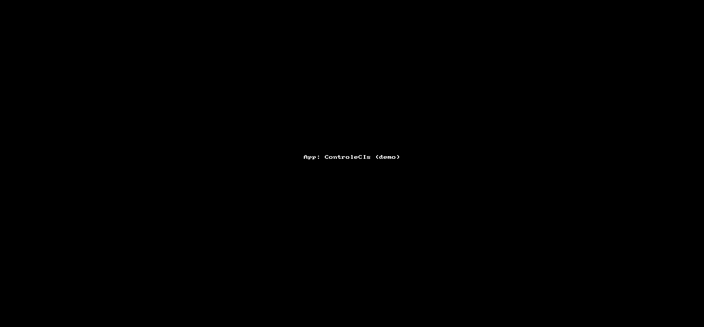

# ControleCIs

<!-- badges: start -->
[](https://lifecycle.r-lib.org/articles/stages.html#experimental)
<!-- badges: end -->

O objetivo do app ControleCIs é acrescentar à planilha de controle existente, a nova demanda recebida, sinalizando duplicidades, quando houver.

Resumo: Planilha de controle atualizada e mensagem, caso seja necessário, sinalizando duplicidade de solicitação de elementar (verificar se na planilha de controle o elementar já havia sido solicitado e retornar o número da CI onde ele foi solicitado – coluna A: Origem). Caso a coluna de elementar esteja vazia, fazer essa verificação através do Item externo e, em casos em que ambos estejam vazias, sinalizar que a planilha não tem o elementar e o externo.


## Instalação

Você pode instalar a versão de desenvolvimento do ControleCIs assim:

``` r
devtools::install_github('wfaquieri/ControleCIs')
```

## Deploy (Shiny apps)

A ferramenta também pode ser acessada diretamente: <https://fgv-ibre.shinyapps.io/ControleCIs/>


## Demonstração



```{r example}
library(ControleCIs)
## basic example code
```

What is special about using `README.Rmd` instead of just `README.md`? You can include R chunks like so:

```{r cars}
summary(cars)
```

You'll still need to render `README.Rmd` regularly, to keep `README.md` up-to-date. `devtools::build_readme()` is handy for this. You could also use GitHub Actions to re-render `README.Rmd` every time you push. An example workflow can be found here: <https://github.com/r-lib/actions/tree/v1/examples>.

You can also embed plots, for example:

```{r pressure, echo = FALSE}
plot(pressure)
```

In that case, don't forget to commit and push the resulting figure files, so they display on GitHub and CRAN.
